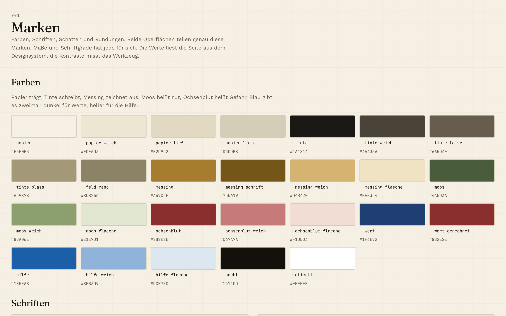
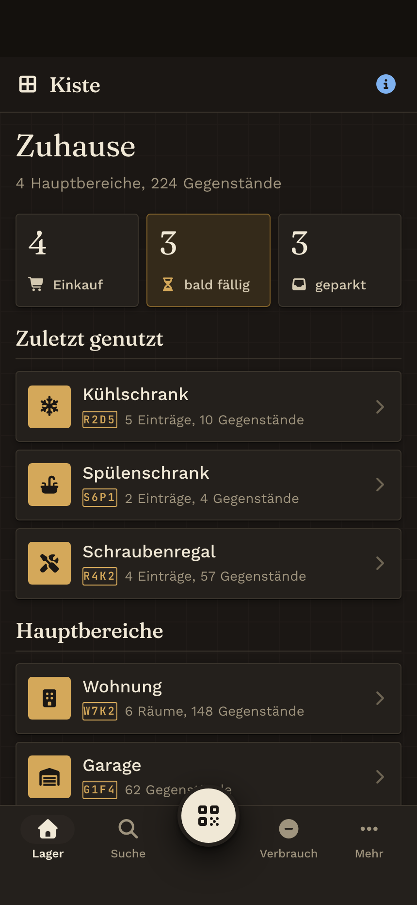
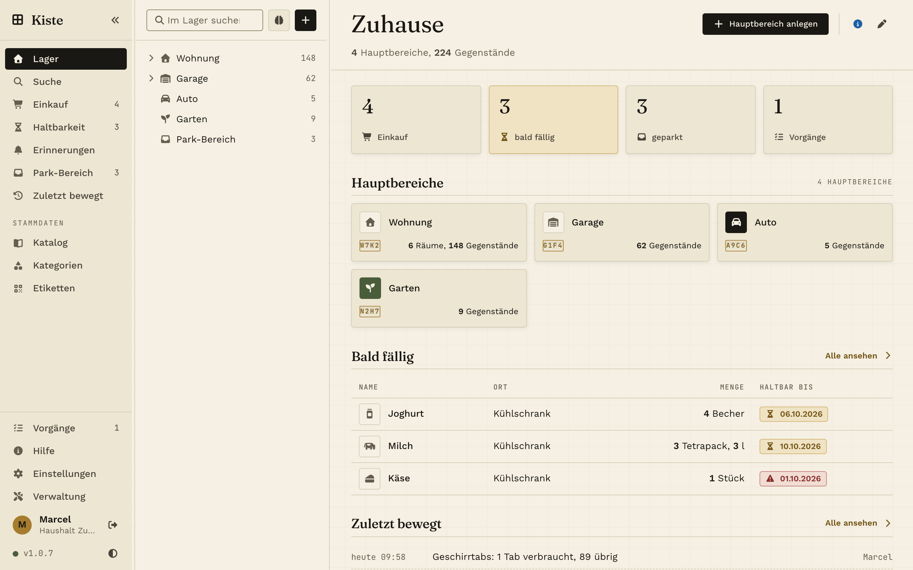
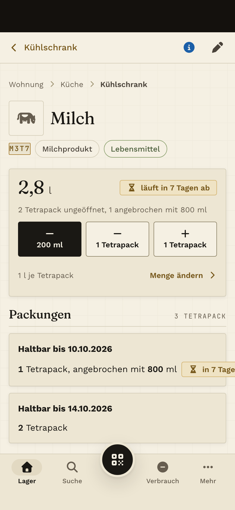

# Kiste Designsystem

**Papier trägt, Tinte schreibt, Messing zeichnet aus.** Ein Designsystem in reinem CSS für eine selbst gehostete Inventar-App mit zwei eigenständigen Oberflächen: eine fürs Handy, eine für den Rechner. Hell und dunkel, Kontraste gemessen, ohne Rahmenwerk und ohne Bauschritt.

**Ansehen:** [hallowelt42.github.io/kiste-designsystem](https://hallowelt42.github.io/kiste-designsystem/), mit allen 110 Beispielseiten in der [Galerie](https://hallowelt42.github.io/kiste-designsystem/galerie.html).

| Marken | Handy, dunkel | Rechner | Eintrag |
|---|---|---|---|
|  |  |  |  |

## Was drin ist

- **Marken** (`stil/10-marken.css`): Farben als Variablen für hell und dunkel, drei Schriften (Fraunces, Work Sans, JetBrains Mono), Schatten, Rundungen, Ebenen.
- **Zeichen** (`stil/20-zeichen.css`): was beide Oberflächen teilen, etwa Code-Stempel, Erscheinungsbild, Mengentext, Score-Marken.
- **Handy** (`stil/handy/`): Maße, Grund, Hülle mit unterer Leiste, Bausteine (Blätter von unten, Felder, Halten-Knopf, Fortschritt), Ansichten.
- **Rechner** (`stil/rechner/`): drei Spalten mit Anfassern, Baum, Tabellen, Fenster, Schubladen, Auswahllisten in der obersten Ebene.
- **110 Beispielseiten**: jede ist echtes HTML mit genau diesen Stilen; Handy-Seiten öffnen sich im Geräterahmen.
- **Schriften und Icons** liegen im Ordner `schriften/` bei. Nichts wird von fremden Servern geladen.

## Grundsätze

- **Kaskadenschichten statt Kampf um Vorrang.** Jede Schicht hat ihren Platz (`stil/00-schichten.css`), kein einziges `!important`.
- **Zwei Oberflächen, keine Umbruchpunkte.** Handy und Rechner haben eigene Maße und Bausteine; geteilt werden nur Marken und Zeichen. Welche gilt, entscheidet `data-oberflaeche` am Wurzelelement.
- **Hell und dunkel aus denselben Marken.** Das Thema wechselt eine Stelle: `data-thema="hell"` oder `"dunkel"`.
- **Kontraste gemessen.** Die Marken-Seite zeigt jede Paarung mit ihrem Wert.
- **Für den Daumen gebaut.** Berührflächen ab 44 Punkten, Feldschrift ab 16 Pixeln, sichere Bereiche, nichts rollt seitlich.

## Nutzen

```bash
git clone https://github.com/HalloWelt42/kiste-designsystem.git
```

Am Handy:

```html
<html lang="de" data-oberflaeche="handy" data-thema="hell">
<link rel="stylesheet" href="stil/00-schichten.css" />
<link rel="stylesheet" href="stil/10-marken.css" />
<link rel="stylesheet" href="stil/20-zeichen.css" />
<link rel="stylesheet" href="stil/handy/40-masse.css" />
<link rel="stylesheet" href="stil/handy/41-grund.css" />
<link rel="stylesheet" href="stil/handy/42-huelle.css" />
<link rel="stylesheet" href="stil/handy/43-bausteine.css" />
<link rel="stylesheet" href="stil/handy/44-ansichten.css" />
```

Am Rechner dieselben ersten drei Dateien, danach `stil/rechner/30-masse.css` bis `34-ansichten.css`. Die Vorlagen [`_vorlage-handy.html`](_vorlage-handy.html) und [`_vorlage-rechner.html`](_vorlage-rechner.html) zeigen den vollständigen Kopf einer Seite samt Schriften und Icons.

Klassen tragen einen Vorsatz: `z-` für Zeichen (beide Oberflächen), `h-` fürs Handy, `r-` für den Rechner, `m-` für die Seiten dieses Repos selbst.

Lokal ansehen:

```bash
python3 -m http.server 8000
```

Danach `http://localhost:8000/` öffnen.

## Herkunft

Das Designsystem gehört zu **Kiste**, einer selbst gehosteten Inventar-App für Haushalt und Familie: Was liegt wo, und wie viel davon. Dieses Repo ist eine Ausgabe; gestaltet wird im Projekt selbst, Seite für Seite, bevor eine Zeile Oberfläche entsteht.

## Lizenz

**Nicht-kommerzielle Nutzung** - Siehe [LICENSE](LICENSE)

Erlaubt: Private Nutzung, Installation, persönliche Anpassungen, Teilen mit Quellenangabe

Verboten: Kommerzielle Nutzung, Verkauf, Einbindung in kommerzielle Produkte

---

## Unterstützen

Kiste Designsystem ist ein privates Hobby-Projekt. Kein Tracking, keine Werbung, keine Kompromisse.

Wenn dir das Projekt gefällt, kannst du dem Repo einen Stern geben - oder direkt hier:

[](https://ko-fi.com/HalloWelt42)

**Crypto:**

| Coin | Adresse |
|------|---------|
| BTC | `bc1qnd599khdkv3v3npmj9ufxzf6h4fzanny2acwqr` |
| DOGE | `DL7tuiYCqm3xQjMDXChdxeQxqUGMACn1ZV` |
| ETH | `0x8A28fc47bFFFA03C8f685fa0836E2dBe1CA14F27` |

Copyright (c) 2026 HalloWelt42
